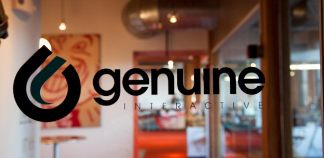

Today is my last day at Genuine Interactive.

Don't bury the lede, right?

I have accepted a position as Manager of Interactive Development at Sapient Global Markets.

It's a very bittersweet departure for me. On the one hand, I have a very exciting new job. On the other hand, Genuine—as my wife likes to point out rather often—has been very good to me, and without the year and change I've spent here, I wouldn't have the opportunity to take a big step forward in my career.

The fact is that Genuine tends to be very good to all of us. John and Chris go far above and beyond even the most generous ways executives generally treat their employees. They're giving, fair, loyal, and trusting. Giving my notice felt a bit like a betrayal of that trust. It was certainly the hardest notice I've ever had to give.

So why am I leaving?

I think Genuine is the best digital agency to work for—certainly in Boston, and possibly anywhere. I have said since I started that I would never leave Genuine for another agency.

And I'm not.

I'll be taking a step away from the digital marketing world and moving more toward full-scale enterprise application development and consulting. I have a feeling that will be a nice change for me and much more in tune with my development philosophy.

This opportunity sort of came up out of the blue. I certainly wasn't looking to leave. As many a recruiter can tell you, I don't pick up the phone when they call. But, on occasion, an organization that is on my general doing-cool-things radar has contacted me directly, and I'd have been a fool to ignore them. Even so, I had a fairly extensive list of requirements—financial, cultural, technological, and more—any organization would have to fulfill to lure me away from Genuine. Luckily for me, but unluckily for Genuine, I suppose, Sapient met all of those requirements.

My new job is a role that will bring me in contact with many of the same architecture and bleeding-edge JavaScript and HTML5 technologies and best practices for full-scale enterprise application development that we've begun to roll out at Genuine, but will allow me to take an even deeper dive into those technologies and best practices and perhaps even develop some new ones of our own.

Though I'm excited about the future, I still leave with a heavy heart. Not just John and Chris, but the entire Genuine team is a group unlike any other I've worked with. I only hope that in my time here, I've made some lasting impact on the front-end team in training, development of processes and best practices, and the general development mindset. That would mean more to me than any project (however cool) I ever got to work on.

And so, thank you to my current and former Genuine colleagues: Adam, Alex, Ali, Ally, Amanda, Amy, Amy, Amy, Andrew, Andrew, Andy, Arlin, Ben, Bill, Bill, Brandon, Brittany, Brittany, Caitlin, Carlos, Carolyn, Cat, Chad, Chris, Chris, Christian, Colby, Craig, Dana, Dennis, DQ, Elliott, Eric, Fitz, Frank, Garrett, Georg, Gwen, Hal, Idaho, Jake, Jake, Jane, Jaqi, Jay, Jenn, Jennifer, Jimbo, Joe, Joe, John, John, Jonathan, Josh, Josh, JP, JR, Julie, Julie, Kate, Kelly, Khan, Kristen, Kyle, Laura, Lauren, Leslie, Lilian, Lindsey, Lindsey, Lisa, Lisa, Maddie, Mahati, Maris, Matt, Matt, Matt, Megan, Mike, Mike, Mike, Mike, Mike, Mike, Mike, Mike, Mike, Nick, Nick, Nicole, OJ, PAM, Perri, Rob, Rob, Robin, Roman, Salem, Sam, Sam, Sam, Shane, Shanna, Stanton, Stephen, Stephen, Tibs, Tim, Tim, Tyler, Vlad, and Will. You all make Genuine the awesome place it is.

And it is an awesome place to work. And <a title="Genuine Interactive Jobs" href="http://www.genuineinteractive.com/working-here/">hiring</a>. Especially if you're named Mike.